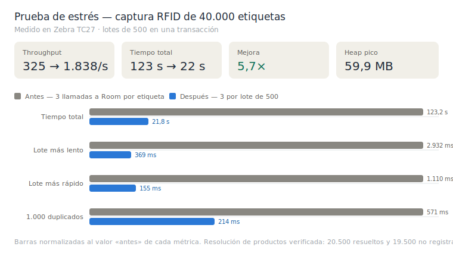

# Inventario Zebra TC27 + RFID

Aplicación Android de **toma de inventario** para el terminal **Zebra TC27** con lector **RFID RFD4030+** (conectado por Bluetooth). Permite capturar inventarios por **código de barras (láser)** y por **lectura RFID**, localizar etiquetas concretas, gestionar los inventarios localmente (offline-first) y **sincronizarlos con un backend** mediante cabeceras firmadas por dispositivo.

Desarrollada por **Diprotec LTDA**.

---

## Índice

1. [Especificaciones técnicas](#especificaciones-técnicas)
2. [Stack tecnológico](#stack-tecnológico)
3. [Arquitectura](#arquitectura)
4. [Funcionamiento completo de la app](#funcionamiento-completo-de-la-app)
5. [Módulo RFID](#módulo-rfid)
6. [Seguridad y autenticación de dispositivo](#seguridad-y-autenticación-de-dispositivo)
7. [API backend](#api-backend)
8. [Base de datos local](#base-de-datos-local)
9. [Sincronización en segundo plano](#sincronización-en-segundo-plano)
10. [Sistema de diseño](#sistema-de-diseño)
11. [Permisos](#permisos)
12. [Pruebas y rendimiento medido](#pruebas-y-rendimiento-medido)
13. [Compilación y firma](#compilación-y-firma)
14. [Estructura del proyecto](#estructura-del-proyecto)

---

## Especificaciones técnicas

| Parámetro | Valor |
|-----------|-------|
| Package / applicationId | `com.diprotec.inventariozebratc27` |
| Versión | 1.0.0 (`versionCode` = major·10000 + minor·100 + patch) |
| minSdk | 29 (Android 10) |
| targetSdk | 35 |
| compileSdk | 36 |
| JVM target | 11 (compilado y probado con JDK 21) |
| Nombre de APK | `ZEBRA_TC27_INVENTARIO_<versionName>.apk` |
| Orientación | Vertical (portrait) fija |
| Modo de datos | Offline-first (Room como fuente local; sincronización diferida) |

**Hardware objetivo:** Zebra TC27 (Android) + lector RFID Zebra RFD4030/RFD40 vía Bluetooth. Escáner de código de barras integrado del TC27 vía EMDK/DataWedge.

**SDKs de hardware:**
- Zebra **EMDK** `com.symbol:emdk:11.0.134` (`compileOnly`; provisto por el dispositivo).
- Zebra **RFID API3** `rfidapi3lib-2.0.5.275.aar` (AAR local en `app/libs/`).

---

## Stack tecnológico

| Área | Tecnología |
|------|------------|
| Lenguaje | Kotlin |
| UI | Jetpack Compose + Material 3 + Navigation Compose |
| Inyección de dependencias | Hilt (+ Hilt WorkManager) |
| Persistencia local | Room (BD versión 30) + DataStore Preferences |
| Red | Retrofit + Moshi + OkHttp (+ logging interceptor) |
| Concurrencia | Kotlin Coroutines / Flow |
| Trabajo en segundo plano | WorkManager (CoroutineWorker + HiltWorkerFactory) |
| Imágenes | Coil |
| Hardware Zebra | EMDK (TC27) + RFID API3 (RFD40) |

Las dependencias se gestionan con el **version catalog** de Gradle (`gradle/libs.versions.toml`). El build usa KSP (Room/Hilt) y el compilador de Compose.

---

## Arquitectura

Clean Architecture por capas dentro de `app/src/main/java/com/diprotec/inventariozebratc27/`:

- **`core/`** — utilidades transversales:
  - `network/` — `ApiCallExecutor` (manejo uniforme de errores y estados del JSON), interceptores (URL base dinámica, medición de uso de datos, logging solo en debug), `ProtectedHeadersBuilder` (cabeceras firmadas).
  - `crypto/` · `key/` — firma del dispositivo, gestión de llaves en Android Keystore, timestamp y canonical string.
  - `session/` — `SessionManager` (sesión de usuario con expiración).
  - `config/` — `SettingsManager` (estado de configuración observable).
  - `gs1/` — `Gs1EpcDecoder` (decodifica EPC: SGTIN-96, SSCC-96, SGLN-96, GRAI-96, GID-96, EPC URI).
  - `format/` · `validator/` — RUT y texto.
- **`data/`** — `local/` (Room: entidades, DAOs, migraciones, DataStore), `remote/` (DTOs, `ApiService`), `mappers/`, `repository/` (interfaz + `Impl` para catálogos; `InventoryRepository` concreto).
- **`di/`** — módulos Hilt: `AppModule`, `DatabaseModule`, `NetworkModule`, `RepositoryModule`, `SecurityModule`, `ServiceModule`.
- **`rfid/`** — `ZebraRfidManager` (conexión, inventario y localización vía SDK Zebra) y modelos de estado/lectura.
- **`scanner/` · `serial/`** — recepción del escáner de código de barras y lectura del serial del dispositivo.
- **`service/`** — `SyncService` (sincronización), `ActivateDeviceService`, `AuthService`, `VersionService`, `ApkDownloader`, `SessionLifecycleService`.
- **`worker/`** — `StartupSyncWorker`, `CatalogSyncWorker`, `PendingInventorySyncWorker`.
- **`ui/`** — pantallas Compose + ViewModels por feature, más `ui/theme/` (design system) y `ui/components/` (componentes reutilizables).

El patrón por pantalla es **MVVM**: `Screen` (Compose, stateless respecto a la lógica) + `ViewModel` (estado en `StateFlow`, sin ningún valor de diseño).

---

## Funcionamiento completo de la app

Punto de entrada: `MainActivity` → `NavGraph` (Navigation Compose). Rutas: `startup_gate`, `login`, `settings`, `main_menu`, `create_inventory`, `pending_inventories`, `rfid_locate`, `rfid_settings`, `rfid_inventory/{id}`, `capture_inventory/{id}`, `inventory_list/{id}`, `sync_logs`, `data_usage`, `about`.

### 1. Arranque (Startup Gate)
Al abrir, `StartupGateScreen` verifica el estado del dispositivo:
- **Activación del dispositivo:** si no está activado, se requiere configurarlo (RUT de empresa, API key, código de activación). El dispositivo se registra contra el backend (`ActivateDispositivo`) y genera/almacena su par de llaves en el Android Keystore.
- **Sesión de dispositivo:** obtiene una `deviceSession` (`LoginDispositivo`) usando el número de serie del equipo.
- **Chequeo de versión / OTA:** consulta la versión vigente (`GetVersion`). Si hay una nueva, muestra `StartupUpdateDialog`; si es obligatoria, bloquea hasta actualizar. La descarga e instalación del APK se hace con `ApkDownloader` + `FileProvider`.
- **Sincronización inicial** de catálogos vía `StartupSyncWorker`.

### 2. Login de usuario
`LoginScreen` autentica al operador (RUT + credenciales) contra los usuarios sincronizados. La sesión de usuario la administra `SessionManager` con **expiración de 3 horas** de inactividad; la actividad se refresca con la interacción (con *throttle* de 1 s).

### 3. Menú principal
`MainMenuScreen` da acceso a las funciones y muestra el indicador de **modo de conexión** (online API / verificando / local) y el semáforo de sincronización (`WorkerTrafficLight`).

### 4. Gestión de inventarios
- **Crear inventario** (`CreateInventoryScreen`): toma un inventario remoto asignado y lo crea localmente para el usuario, eligiendo el modo de lectura (láser o RFID).
- **Inventarios pendientes** (`PendingInventoriesScreen`): lista los inventarios en curso del usuario; los vencidos (según fecha `hasta`) pasan a estado `EXPIRED`.

### 5. Captura por código de barras (láser)
`CaptureInventoryScreen` + `CaptureInventoryViewModel`:
- Modos **UNIDAD** (cantidad 1) y **CANTIDAD** (numérico con decimales).
- Selección de **ubicación** y **unidad de medida** (catálogos sincronizados).
- Lectura por escáner del TC27 o ingreso manual (validado: solo alfanumérico, máx. 50 caracteres). Se resuelve la descripción del producto y se registra la captura.

### 6. Captura por RFID
`InventoryRfidScreen` + `InventoryRfidViewModel`:
- Al iniciar, `ZebraRfidManager` configura el lector (potencia máxima, sesión S0, DPO off, reporte continuo) y limpia el buffer.
- Cada etiqueta leída se **deduplica en dos niveles** (ver [Módulo RFID](#módulo-rfid)); las etiquetas nuevas se registran una sola vez.
- Contadores en pantalla: lecturas válidas y duplicadas. Selección de ubicación/unidad como en la captura láser.

### 7. Localización de etiqueta (modo "Geiger")
`RfidLocateScreen` + `RfidLocateViewModel`: se busca un producto (por código principal/secundario o descripción), se generan los posibles EPC (directo, ASCII-HEX, con relleno a 24 dígitos) y se inicia `TagLocationing`. La **proximidad** se muestra como porcentaje (barra animada) y con un **tono acústico** cuya cadencia aumenta al acercarse.

### 8. Listado de capturas
`InventoryListScreen`: muestra las capturas del inventario, en vista **agrupada** (por producto/ubicación/unidad, con suma de cantidades) o **desagrupada**. Permite **eliminar** capturas cuando la regla de negocio del perfil lo autoriza y el inventario no está finalizado.

### 9. Finalización y sincronización
- **Finalizar** un inventario lo marca `FINISHED` localmente y dispara el envío al backend.
- **Envío de registros** (`SendRegistroInventario`): agrupa las capturas pendientes por inventario/usuario y las envía **troceadas en bloques de 500** (un inventario RFID puede acumular miles de lecturas y un único request con todas arriesgaría timeouts o rechazo del servidor). Cada bloque se marca como sincronizado por separado, de modo que un fallo no descarta el progreso ya confirmado.
- **Cierre remoto** (`FinishInventario`): notifica la finalización al backend.
- Todo evento de sincronización queda registrado en el **log de sincronización** (`SyncLogScreen`), con resultado y modo de conexión.

### 10. Utilidades
- **Configuración RFID** (`RfidSettingsScreen`, desde el menú principal, sin restricción de perfil): permite ajustar la **potencia de antena por separado** para inventario y para localización (0-100 %), el **volumen del beep del lector** (Alto/Medio/Bajo/Silencio) y el **volumen del tono de proximidad** de la app (0-100 %, 0 % silencia), de forma independiente. Incluye restaurar valores por defecto. Los cambios se aplican en la siguiente lectura o búsqueda.
- **Uso de datos** (`DataUsageScreen`): consumo de red medido por interceptor, clasificado por origen.
- **Ajustes** (`SettingsScreen`): configuración de empresa/API/URL base y opciones (incluye accesos de super-admin).
- **Acerca de** (`AboutScreen`): versión e información de la app.

---

## Módulo RFID

`ZebraRfidManager` es un `@Singleton` que encapsula el SDK Zebra RFID API3 (transporte Bluetooth).

**Perfil de lectura (inventario):** al conectar/configurar aplica:
- **Potencia RF configurable** (por defecto **100 %** = máximo soportado, leído de `ReaderCapabilities`).
- **Sesión de singulación S0** y población de tags 30.
- **DPO (Dynamic Power Optimization) desactivado** para lecturas consistentes.
- **Reporte continuo** (`setUniqueTagReport(false)`): cada etiqueta se reporta repetidamente para no perder lecturas.
- **Volumen del beeper del lector** configurable (`Config.setBeeperVolume`).

**Perfil de localización (Geiger):** usa una **potencia RF menor** (por defecto **50 %**) para que la distancia relativa varíe de forma gradual al acercarse y no se sature; mantiene S0 y DPO off.

**Configuración de potencia:** se persiste como **porcentaje (0-100 %), no como índice**. El índice de potencia depende del lector conectado, mientras que el porcentaje puede configurarse sin lector presente, es portable entre modelos y se convierte al índice soportado en el momento de aplicarlo (acotado al rango real del equipo). Ver [Configuración RFID](#10-utilidades).

**Pipeline de lectura:**
- `eventReadNotify` **drena el buffer del lector por lotes** (`getReadTags` en bucle hasta vaciarlo) y publica cada lectura con `tryEmit` en un `SharedFlow` acotado (buffer con `DROP_OLDEST`), de modo que el hilo del SDK nunca se bloquea y la memoria no crece sin límite.
- La localización emite la distancia relativa por un `SharedFlow` propio.

**Deduplicación en dos niveles:**
1. **En memoria (por sesión):** `seenEpcs` en `InventoryRfidViewModel` descarta en O(1) las relecturas continuas de una misma etiqueta **sin consultar la base de datos**. Se limpia al cargar/detener/finalizar/salir del inventario.
2. **Persistente (BD):** `InventoryRepository.registerRfidInventoryItem` calcula una clave GS1 única (para SGTIN-96 incluye GTIN + serial, de modo que cada etiqueta física es distinta) y consulta un índice `inventoryId + rfidGs1Key`; si ya existe, la marca como duplicada en lugar de insertarla.

**Robustez ante volumen excesivo:** para no perder etiquetas cuando el lector reporta muchísimas lecturas, la captura RFID **persiste por lotes**: los EPC nuevos se encolan y se vacían en micro-lotes (~150 ms, hasta 500 por lote) dentro de **una sola transacción** (`registerRfidInventoryItems` + `AppDatabase.withTransaction`). El `SharedFlow` de lecturas usa un buffer amplio (16384) con `DROP_OLDEST` para absorber ráfagas sin agotar memoria. El lote pendiente se **vacía por completo antes de cerrar** la sesión (detener/finalizar/salir) y, si un lote falla, sus EPC vuelven a habilitarse para recaptura. El resultado del inventario es idéntico al de carga normal.

Cada lote se resuelve con **tres operaciones**, no tres por etiqueta: una consulta de duplicados, una de productos y un único `insertAll`. Esa es la razón del throughput de ~1.840 etiquetas/s (ver [Pruebas y rendimiento medido](#pruebas-y-rendimiento-medido)).

### Resolución del producto

Las etiquetas en terreno vienen con **dos codificaciones**: GS1 **SGTIN-96** (con el GTIN embebido) y el **código del producto grabado en crudo**. Por eso, de cada EPC se derivan varios **candidatos** (`core/gs1/RfidProductCodeCandidates`) —GTIN, EPC tal cual, EPC sin ceros a la izquierda, y el hex decodificado como ASCII— que es la operación inversa de la que hace la pantalla de localización al generar el EPC a buscar.

La detección **replica la del inventario láser**: se busca por `codigo`/`codigoSecundario` (de forma **insensible a mayúsculas**, ya que los candidatos vienen normalizados en mayúsculas) y:

- **Con coincidencia** → se guarda la descripción del producto y su `codigo` del catálogo, que es lo que el backend recibe como `ProductoCodigo`.
- **Sin coincidencia** (o producto sin descripción) → se guarda `"Producto no registrado"` y el GTIN/EPC como traza.

En ningún caso se bloquea la lectura. El deduplicado sigue basándose en la clave del EPC, nunca en el código del producto: dos etiquetas físicas del mismo artículo cuentan por separado.

---

## Seguridad y autenticación de dispositivo

Cada petición autenticada al backend viaja con cabeceras construidas por `ProtectedHeadersBuilder`:

| Cabecera | Contenido |
|----------|-----------|
| `X-API-KEY` | Clave de API de la empresa |
| `Authorization` | `Bearer <authToken>` |
| `X-DEVICE-SESSION` | Sesión del dispositivo (obtenida en `LoginDispositivo`) |
| `X-DEVICE-SIGNATURE` | Firma criptográfica de la petición (método + URL + timestamp) generada con la llave privada del dispositivo |
| `X-DEVICE-TIMESTAMP` | Marca de tiempo de la firma |

- Las **llaves del dispositivo** se generan y guardan en el **Android Keystore** (`core/key/`); la firma se realiza con `DeviceSigner` sobre un *canonical string*.
- El **logging de red** (cuerpos y cabeceras) solo se activa en compilaciones **debug**; las cabeceras sensibles se **enmascaran** en los logs.
- Credenciales y sesión se almacenan en **DataStore Preferences**.

> Nota: hoy los tokens en DataStore no están cifrados en reposo y el tráfico permite *cleartext* (`usesCleartextTraffic=true`). Son mejoras de seguridad pendientes de evaluación (dependen de que el backend sirva por HTTPS y de una migración de almacenamiento).

---

## API backend

Base: `https://<host>/api/website/v1/…` (URL base **dinámica** desde ajustes; `DynamicBaseUrlInterceptor`). Timeouts: conexión 60 s, lectura/escritura 120 s.

| Método | Endpoint | Uso |
|--------|----------|-----|
| POST | `dispositivos/{empresaRUT}/ActivateDispositivo` | Activación del dispositivo |
| POST | `dispositivos/{empresaRUT}/LoginDispositivo` | Sesión de dispositivo (por serie) |
| POST | `versiones/{empresaRUT}/GetVersion` | Chequeo de versión / OTA |
| GET | `usuarios/{empresaRUT}/GetUsuarios` | Catálogo de usuarios |
| GET | `reglas/{empresaRUT}/GetReglas` | Reglas de negocio |
| GET | `ubicaciones/{empresaRUT}/GetUbicaciones` | Catálogo de ubicaciones |
| GET | `productos/{empresaRUT}/GetProductos` | Catálogo de productos |
| GET | `unidadmedidas/{empresaRUT}/GetUnidadMedidas` | Unidades de medida |
| GET | `inventarios/{empresaRUT}/GetInventarios` | Inventarios remotos asignados |
| POST | `inventarios/{empresaRUT}/SendRegistroInventario` | Envío de capturas |
| POST | `inventarios/{empresaRUT}/FinishInventario` | Cierre de inventario |

`ApiCallExecutor` normaliza errores HTTP y el estado dentro del JSON (0/200 = éxito) a `ApiException` con mensajes seguros para el usuario.

---

## Base de datos local

Room, **versión 30** (`AppDatabase`). Migraciones incrementales en `DatabaseMigrations` (p. ej. 28→29 añade `tipoLectura`; 29→30 añade los campos RFID e índices de deduplicación).

**Entidades principales:** `UserEntity`, `RuleEntity`, `LocationEntity`, `ProductEntity`, `UnitMeasureEntity`, `InventoryEntity`, `InventoryItemEntity`, `InventoryRemoteEntity` / `InventoryRemoteUserEntity`, `BarcodeEntity`, `SyncLogEntity`, `NetworkUsageEntity`.

Los catálogos se reemplazan de forma **transaccional** (`clearAll` + `upsertAll` dentro de `@Transaction`). Las capturas de inventario (`inventory_items`) tienen índices por `inventoryId + rfidGs1Key` y por estado de sincronización para consultas eficientes.

---

## Sincronización en segundo plano

WorkManager con `HiltWorkerFactory` (el inicializador automático de WorkManager está desactivado en el manifest):

- **`StartupSyncWorker`** — sincronización al arranque (catálogos e inventarios).
- **`CatalogSyncWorker`** — sincronización **periódica cada 15 minutos** (requiere red), con *backoff* exponencial (30 s) y reintento ante errores de red/servidor.
- **`PendingInventorySyncWorker`** — envía capturas y cierres pendientes cuando hay conectividad.

`SyncService` orquesta la sincronización de catálogos (usuarios, reglas, ubicaciones, productos, unidades, inventarios remotos) y el envío/cierre de inventarios, registrando cada evento en el log.

---

## Sistema de diseño

Todo el estilo visual vive en la capa de diseño; las pantallas y ViewModels **no contienen valores de diseño hardcodeados**.

- **`ui/theme/Color.kt`** — paleta de marca y colores semánticos de estado (`StatusOnline` #2E7D32, `StatusWarning` #F9A825, `StatusError` #C62828).
- **`ui/theme/Type.kt`** — una sola `FontFamily` y la escala tipográfica completa (headline/title/body/label).
- **`ui/theme/Dimens.kt`** — escala de espaciado, alturas, iconos, bordes, radios, elevaciones y anchos responsivos.
- **`ui/theme/Shape.kt`** — formas Material3 (radios 10/16/24 dp).
- **`ui/theme/Theme.kt`** — `MaterialTheme` con colorScheme + typography + shapes.
- **`ui/components/AppComponents.kt`** — componentes reutilizables: `AppActionButton` (primary/secondary/outline), `AppTopBar`, `AppCard`, `AppTextField`, `SectionTitle`, `StatusDot`, `StatusChip`.
- **`ui/common/`** — `AppFloatingMessage` (mensajes flotantes) y `ResponsiveLayout` (adaptación a ancho).

---

## Permisos

Declarados en `AndroidManifest.xml`:

- **Bluetooth:** `BLUETOOTH_CONNECT`, `BLUETOOTH_SCAN` (Android 12+); `BLUETOOTH`, `BLUETOOTH_ADMIN` (≤ Android 11); `ACCESS_FINE_LOCATION` (descubrimiento BT).
- **Zebra:** `com.symbol.emdk.permission.EMDK`, `com.zebra.provider.READ` (OEMInfo / serial).
- **Red / sistema:** `INTERNET`, `ACCESS_NETWORK_STATE`, `REQUEST_INSTALL_PACKAGES` (OTA de la propia app).
- `queries` para EMDK service y el content provider de Zebra; `FileProvider` para instalar el APK descargado.

---

## Pruebas y rendimiento medido

### Prueba de estrés de captura RFID

`app/src/androidTest/.../RfidMassiveCaptureStressTest.kt` simula **40.000 etiquetas únicas**
por el mismo camino que usa la app (deduplicación en memoria + persistencia por lotes
transaccionales). **No requiere etiquetas físicas ni el lector**: genera EPCs SGTIN-96
válidos y únicos. Usa una base de datos separada y no toca datos reales.

```bash
./gradlew connectedDebugAndroidTest \
  -Pandroid.testInstrumentationRunnerArguments.class=com.diprotec.inventariozebratc27.RfidMassiveCaptureStressTest
```

Genera un informe HTML con gráficos y un CSV en
`/sdcard/Android/data/com.diprotec.inventariozebratc27/files/`; el resumen sale por logcat
con el tag `RFID_STRESS`.

### Límites medidos (Zebra TC27, 40.000 etiquetas)



| Métrica | Valor |
|---------|-------|
| Throughput de escritura | **~1.840 etiquetas/s** |
| Tiempo de persistir 40.000 capturas | **~22 s** (80 lotes de 500) |
| Coste de detectar un duplicado | ~0,2 ms |
| Memoria | pico de 59,9 MB, con solo +11,8 MB de crecimiento — sin riesgo de OOM |
| Carga de 40.000 capturas pendientes | ~1,8 s → 80 bloques de envío |

**Implicación operativa:** a ~1.840 etiquetas/s la base de datos escribe más rápido de lo que
el lector produce (~700-900 tags/s), así que no se acumula backlog y el vaciado al detener es
prácticamente inmediato. El indicador "Procesando capturas…" sigue existiendo como red de
seguridad para volúmenes extremos.

> **Cómo se llegó aquí — dos investigaciones, una fallida:**
>
> 1. **Podar índices: descartado.** De los 9 índices de `inventory_items` solo 3 sirven a una
>    consulta real, pero podarlos **no mejoró el rendimiento** (+2,6 %, dentro del ruido de
>    una sola corrida). El mantenimiento de índices no era el cuello de botella.
> 2. **Reducir llamadas a Room: 5,7× más rápido.** Las mediciones mostraron que el coste
>    escalaba con el **número de llamadas** (1 llamada ≈ 0,6 ms; 3 llamadas ≈ 3 ms por
>    etiqueta), no con el trabajo de SQLite. Pasar de 3 llamadas por etiqueta a 3 por lote de
>    500 subió el throughput de 325 a 1.838 etiquetas/s. Ver el CHANGELOG.

## Compilación y firma

Requisitos: JDK 11+ (probado con **Java 21**), Android SDK. El SDK de RFID se incluye como AAR local en `app/libs/`.

```bash
./gradlew compileDebugKotlin   # solo compilar (sin empaquetar)
./gradlew assembleDebug        # APK de depuración
./gradlew assembleRelease      # APK de release (minify + shrink; requiere firma)
```

- **Release:** `isMinifyEnabled` + `isShrinkResources` con ProGuard/R8 (`app/proguard-rules.pro`).
- El APK de salida se nombra `ZEBRA_TC27_INVENTARIO_<versionName>.apk`.

> **Seguridad de repositorio:** las llaves de firma (`*.jks`, `*.pem`), `local.properties`, los directorios de build y los APK/artefactos están excluidos por `.gitignore` y **no deben** subirse al repositorio. Respalda el keystore en un gestor de secretos: sin él no se pueden firmar releases futuras.

---

## Estructura del proyecto

```
app/src/main/java/com/diprotec/inventariozebratc27/
├── core/         # red, cripto/llaves, sesión, config, gs1, formato, validadores
├── data/         # local (Room, DataStore), remote (DTO/API), mappers, repository
├── di/           # módulos Hilt
├── rfid/         # ZebraRfidManager + modelos
├── scanner/ serial/   # escáner de código de barras y serial del equipo
├── service/      # SyncService, activación, auth, versión, descarga APK, sesión
├── worker/       # workers de sincronización
└── ui/           # pantallas + ViewModels + theme (design system) + components
```
